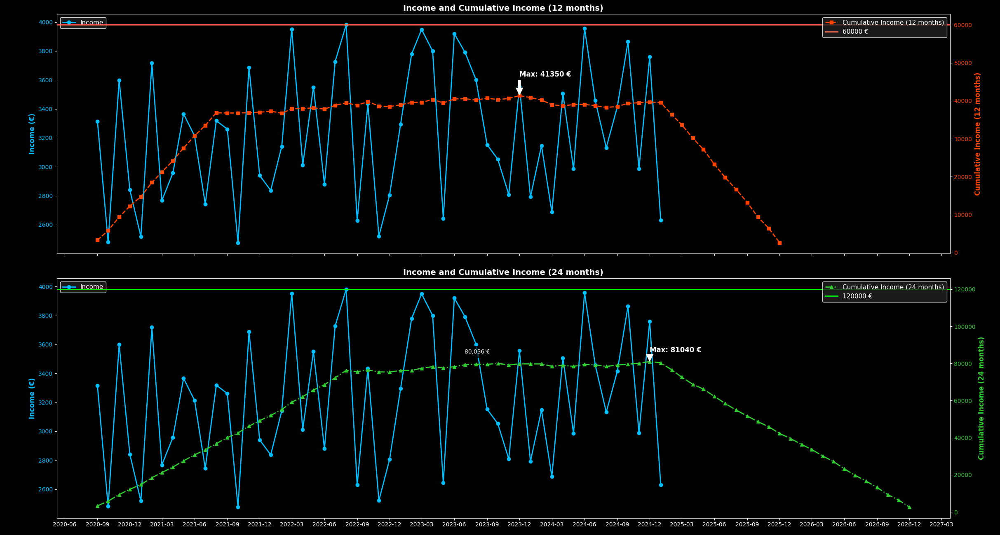

> 📝 Odločil sem se, da ta projekt objavim javno, saj je do popolnosti napisan z uporabo ChatGPT – ja, tudi ta README.md!
#### ⚠ Omejitev odgovornosti: Projekt uporabljate na lastno odgovornost. Za morebitne napake, nepravilnosti ali poškodbe, nastale pri uporabi, ne odgovarjam.
Ta repozitorij vsebuje Python aplikacijo za vizualizacijo mesečnih dohodkov in kumulativnih dohodkov v obdobju 12 in 24 mesecev.
Prikaže datum in vrednost najvišje vrednost komulativnih dohodkov. Dodani sta še limiti na 60k in 120k, kar je meja za izstop iz sistema normiranstva od 2025 dalje.
Projekt je popolnoma odprtokoden in omogoča enostavno uporabo tako s predhodno skompilirano main.exe datoteko kot tudi z izvornim main.py skriptom.
# 🖼️ Primer izrisa


### 📁 Struktura projekta
```
│   dohodki.xlsx          # Excel z dummy podatki za razvoj
│   icon.ico              # Ikona aplikacije (ni nujno potrebna)
│   main.py               # Glavni Python skript
│   main.spec             # PyInstaller specifikacija (za generiranje .exe)
│   requirements.txt      # Seznam odvisnosti
│
├───build/                # Vmesni build PyInstallerja
│
└───dist/                 # Končni build
        dohodki.xlsx      # Excel z dummy podatki (vnesi svoje podatke)
        main.exe          # Izvršljiva datoteka aplikacije
```
## 🚀 Kako zagnati aplikacijo?
Obstajata dva načina za uporabo aplikacije:

### 1️⃣ Uporaba že skompilirane verzije (main.exe)
Če uporabljaš Windows, lahko brez nameščanja dodatnih odvisnosti neposredno zaženeš aplikacijo:

1. Prenesi dist/main.exe in dist/dohodki.xlsx
2. Vnesi svoje podatke v dohodki.xlsx (trenutno so v datoteki dummy podatki)
3. Zaženi main.exe
📌 Opomba: Če se aplikacija ne zažene, preveri, ali imaš ustrezne pravice za zagon .exe datotek ali pa poskusi zaženiti kot skrbnik.

### 2️⃣ Zagon izvorne kode (main.py)
Če želiš aplikacijo poganjati neposredno iz izvorne kode, sledi tem korakom:

> 🛠 1. Namestitev Python okolja
Prepričaj se, da imaš nameščen Python 3.13.2. Lahko preveriš svojo verzijo s tem ukazom:
```
python -V
```
Če Python ni nameščen, ga prenesi in namesti z uradne strani.

> 📦 2. Namestitev knižnjic
Najprej kloniraj repozitorij ali prenesi datoteke, nato v terminalu vstopi v mapo projekta in zaženi:
```
pip install -r requirements.txt
```
To bo namestilo vse potrebne pakete.

> ▶️ 3. Zagon aplikacije
Ko so vse odvisnosti nameščene, lahko aplikacijo zaženeš z ukazom:
```
python main.py
```
Aplikacija bo prebrala dohodki.xlsx in prikazala grafični prikaz dohodkov.

### 📊 Podatkovna datoteka dohodki.xlsx
Datoteka dohodki.xlsx vsebuje dummy podatke o dohodkih v naslednjem formatu:
```
year	month	income
2020	9	3179
2020	10	2401
2020	11	3030
...	...	...
```
Stolpca year in month predstavljata leto in mesec prihodka.
Stolpec income prikazuje dohodek v posameznem mesecu.
Podatki se nato uporabljajo za izračun kumulativnega dohodka v obdobju 12 in 24 mesecev.
### 📦 Kako ustvariti .exe datoteko?
Če želiš sam skompilirati aplikacijo v .exe, uporabi PyInstaller:
```
pip install pyinstaller
pyinstaller --onefile --windowed --icon=icon.ico main.py
```
To bo ustvarilo dist/main.exe, ki ga lahko deliš z drugimi uporabniki.

### 📜 Licenca
Ta projekt je odprtokoden in objavljen pod MIT licenco, kar pomeni, da ga lahko uporabljaš, spreminjaš in distribuiraš brez omejitev.

### 📢 Če ti je moja skromna melenkost vsaj malo pomagala, bom vesel zvezdice ⭐ na GitHubu! 🎉
